# TensorflowAPI

TensorFlow is a free and open-source software library for dataflow and differentiable programming across a range of tasks. It is a symbolic math library, and is also used for machine learning applications such as neural networks.TensorFlow was developed by the Google Brain team for internal Google use. It was released under the Apache License 2.0 on November 9, 2015.

Starting in 2011, Google Brain built DistBelief as a proprietary machine learning system based on deep learning neural networks. Its use grew rapidly across diverse Alphabet companies in both research and commercial applications.Google assigned multiple computer scientists, including Jeff Dean, to simplify and refactor the codebase of DistBelief into a faster, more robust application-grade library, which became TensorFlow. In 2009, the team, led by Geoffrey Hinton, had implemented generalized backpropagation and other improvements which allowed generation of neural networks with substantially higher accuracy, for instance a 25% reduction in errors in speech recognition.

## Tensorflow

TensorFlow is Google Brain's second-generation system. Version 1.0.0 was released on February 11, 2017.While the reference implementation runs on single devices, TensorFlow can run on multiple CPUs and GPUs (with optional CUDA and SYCL extensions for general-purpose computing on graphics processing units).TensorFlow is available on 64-bit Linux, macOS, Windows, and mobile computing platforms including Android and iOS.Its flexible architecture allows for the easy deployment of computation across a variety of platforms (CPUs, GPUs, TPUs), and from desktops to clusters of servers to mobile and edge devices.

TensorFlow computations are expressed as stateful dataflow graphs. The name TensorFlow derives from the operations that such neural networks perform on multidimensional data arrays, which are referred to as tensors. During the Google I/O Conference in June 2016, Jeff Dean stated that 1,500 repositories on GitHub mentioned TensorFlow, of which only 5 were from Google.

## Tensor processing unit (TPU)

In May 2017, Google announced a software stack specifically for mobile development, TensorFlow Lite.In January 2019, TensorFlow team released a developer preview of the mobile GPU inference engine with OpenGL ES 3.1 Compute Shaders on Android devices and Metal Compute Shaders on iOS devices.In May 2019, Google announced that their TensorFlow Lite Micro (also known as TensorFlow Lite for Microcontrollers) and ARM's uTensor would be merging.

## Where can Tensorflow run?

TensorFlow can hardware, and software requirements can be classified into
Development Phase: This is when you train the mode. Training is usually done on your Desktop or laptop.
Run Phase or Inference Phase: Once training is done Tensorflow can be run on many different platforms. You can run it on
  - Desktop running Windows, macOS or Linux
  
  - Cloud as a web service
  
  - Mobile devices like iOS and Android
 You can train it on multiple machines then you can run it on a different machine, once you have the trained model.The model can be trained and used on GPUs as well as CPUs. GPUs were initially designed for video games. In late 2010, Stanford researchers found that GPU was also very good at matrix operations and algebra so that it makes them very fast for doing these kinds of calculations. Deep learning relies on a lot of matrix multiplication. TensorFlow is very fast at computing the matrix multiplication because it is written in C++. Although it is implemented in C++, TensorFlow can be accessed and controlled by other languages mainly, Python.
 
 Finally, a significant feature of TensorFlow is the TensorBoard. The TensorBoard enables to monitor graphically and visually what TensorFlow is doing.

## Introduction to Components of TensorFlow
### Tensor

Tensorflow's name is directly derived from its core framework: Tensor. In Tensorflow, all the computations involve tensors. A tensor is a vector or matrix of n-dimensions that represents all types of data. All values in a tensor hold identical data type with a known (or partially known) shape. The shape of the data is the dimensionality of the matrix or array.

A tensor can be originated from the input data or the result of a computation. In TensorFlow, all the operations are conducted inside a graph. The graph is a set of computation that takes place successively. Each operation is called an op node and are connected to each other.

The graph outlines the ops and connections between the nodes. However, it does not display the values. The edge of the nodes is the tensor, i.e., a way to populate the operation with data.

## Graphs

TensorFlow makes use of a graph framework. The graph gathers and describes all the series computations done during the training. The graph has lots of advantages:
- It was done to run on multiple CPUs or GPUs and even mobile operating system

- The portability of the graph allows to preserve the computations for immediate or later use. The graph can be saved to be executed in the future.

- All the computations in the graph are done by connecting tensors together.A tensor has a node and an edge. The node carries the mathematical operation and produces an endpoints outputs. The edges the edges explain the input/output relationships between nodes.

## Why is TensorFlow popular?

TensorFlow is the best library of all because it is built to be accessible for everyone. Tensorflow library incorporates different API to built at scale deep learning architecture like CNN or RNN. TensorFlow is based on graph computation; it allows the developer to visualize the construction of the neural network with Tensorboad. This tool is helpful to debug the program. Finally, Tensorflow is built to be deployed at scale. It runs on CPU and GPU.

Tensorflow attracts the largest popularity on GitHub compare to the other deep learning framework.

## List of Prominent Algorithms supported by TensorFlow

Currently, TensorFlow 1.10 has a built-in API for:

 - Linear regression: tf.estimator.LinearRegressor
 - Classification:tf.estimator.LinearClassifier
 - Deep learning classification: tf.estimator.DNNClassifier
 - Deep learning wipe and deep: tf.estimator.DNNLinearCombinedClassifier
 - Booster tree regression: tf.estimator.BoostedTreesRegressor
 - Boosted tree classification: tf.estimator.BoostedTreesClassifier
 
 # Steps in Machine learning for Object detection using Tensorflow
 
 Installations:
''' 
- pip install pillow
- pip install lxml
- pip install jupyter
- pip install matplotlib

'''

git clone https://github.com/tensorflow/models.git or download the models file from link- https://github.com/tensorflow/models to our Ubuntu server/machine and extract it.

On Ubuntu:
'''
protoc object_detection/protos/*.proto --python_out=.
'''

And...

'''
export PYTHONPATH=$PYTHONPATH:`pwd`:`pwd`/slim

'''
If you get an error on the protoc command on Ubuntu, check the version you are running with protoc --version, if it's not the latest version, you might want to update. As of my writing of this, we're using 3.4.0. In order to update or get protoc, head to the protoc releases page. Download the python version, extract, navigate into the directory and then do:
'''
sudo ./configure
sudo make check
sudo make install
'''
On Windows:
Head to the protoc releases page and download the protoc-3.4.0-win32.zip, extract it, and you will find protoc.exe in the bin directory.
You can move this to something more appropriate if you like, or leave it here. I eventually put mine in program files, making a "protoc" directory and dropping it in there.
Now, from within the models (or models-master) directory, you can use the protoccommand like so:
'''
"C:/Program Files/protoc/bin/protoc" object_detection/protos/*.proto --python_out=.

Next, open terminal/cmd.exe from the models/object_detection directory
'''
- Step-1: Gather all kinds of images (i.e., permutation and combinations of ways/possibilities/degrees that  the object can exist in the image in a 3D space)  for the multiple objects that is of our interest. Divide the image dataset into test and train folders wherein 80% of images must be in train folder and 20% in test folder.For example in our case it is 500 images of Geico in train set and 100 images in test set.

- Step-2: Annotate/plot the bounding boxes for the object using LabelImg  tool to generate xml for each corresponding image in test and train folders as below screenshot.

This generates xmls in pascal voc dataset format.

- Step-3: Convert  all  xml in train and test folders to Corresponding CSV’s as- train_labels.csv and test_labels.csv.
      	Place test and train folders inside images2 folder in models/research/object_detection    with  xml_to _csv.py

Within the xml_to_csv script, change the 2nd line with train folder and 4th line with corresponding 
'train_labels.csv’. Similarly for test folder also.
'''
def main():
    image_path = os.path.join(os.getcwd(), 'train')
    xml_df = xml_to_csv(image_path)
    xml_df.to_csv('train_labels.csv', index=None)
    print('Successfully converted xml to csv.')
 '''

  Run the command “Python3  xml_to _csv.py “  from models/research/object_detection/images2 / in the terminal  for train and test folder twice.one for test folder and other for train folder.
  After running the above command the train_labels.csv and test_labels.csv are generated.
  Now we create a data directory in models/research/object_detection .We copy and paste csv’s generated in images2  folder into data folder.

### Step-4: Convert all CSV data to tfrecords as- train. record and test.record.

  Place test and train folders  in models/research/object_detection  as per the below structure in screenshot. That is we need to copy and paste all train and test images and corresponding  xmls outside the test and train folder as below screenshot. 

Edit  generate_tfrecord_2.py ,in our case we detect  Geico .So we changed 3rd line of code to “Geico”(one class).
If we had many classes, then we would need to keep building out this if statement.

### TO-DO replace this with label map
'''
def class_text_to_int(row_label):
    if row_label == 'Geico':
        return 1
    else:
        None
   '''     
And then:

	Run the command-
'''
#### From models/research
protoc object_detection/protos/*.proto --python_out=.

'''

  If we get an error on the protoc command on Ubuntu, check the version we are running with protoc --version, if it's not the latest version, we might want to update. As of my writing of this, we're using 3.4.0. In order to update or get protoc, head to the protoc releases page. Download the python version, extract, navigate into the directory and then do:
'''
- sudo ./configure
- sudo make check
- sudo make install
'''
  After that, try the protoc command again (again, make sure you are issuing this from the research dir in my case).
### From models/research/
'''
export PYTHONPATH=$PYTHONPATH:`pwd`:`pwd`/slim
'''
  Finally, let's install the object_dection library formally by doing the following from within the models directory:
sudo python3 setup.py install

  Now we can run the generate_tfrecord_2.py script. We will run it twice, once for the train TFRecord and once for the test TFRecord.
  Run the command to generate tf records-
### From models/research/object_detection/
'''

python3 generate_tfrecord.py --csv_input=data/train_labels.csv --output_path=data/train.record --image_dir=images2/

python3 generate_tfrecord.py --csv_input=data/test_labels.csv --output_path=data/test.record --image_dir=images2/

'''

 Now, in our data directory, we should have train.record and test.record.

Step-5: Train Custom Object Detector using tf records for train and test set using a pre-trained model and then using transfer learning approach.
We are  going to go with mobilenet, using the following checkpoint and configuration file
From models/research/object_detection
 Run the command-
'''
wget https://raw.githubusercontent.com/tensorflow/models/master/object_detection/samples/configs/ssd_mobilenet_v1_pets.config
 
wget http://download.tensorflow.org/models/object_detection/ssd_mobilenet_v1_coco_11_06_2017.tar.gz
'''

Put the config in the training folder, and extract the ssd_mobilenet_v1 in the  models/object_detection folder
 Create label map as object-detection.pbtxt as below
Inside training dir, add object-detection.pbtxt:
'''
item {
  id: 1
  name: 'macncheese'
}
'''

In the configuration file, we need to search for all of the PATH_TO_BE_CONFIGURED points and change them. we may also want to modify batch size. Currently, it is set to 1 in my configuration file. Other models may have different batch sizes. If we get a memory error, we can try to decrease the batch size to get the model to fit in your VRAM. Finally, we also need to change the checkpoint name/path, num_classes to 1, num_examples to 12, and label_map_path: "training/object-detect.pbtxt"

Here is our ssd_mobilenet_v1_pets_Geico.config file with few edits

num_classes=1 in our  case

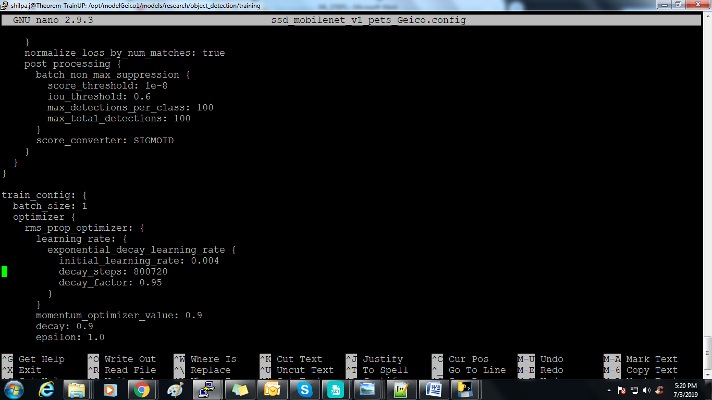

Change the batch size according to your system/server config.In our case, we have set it to                   1, since there was a memory issue.

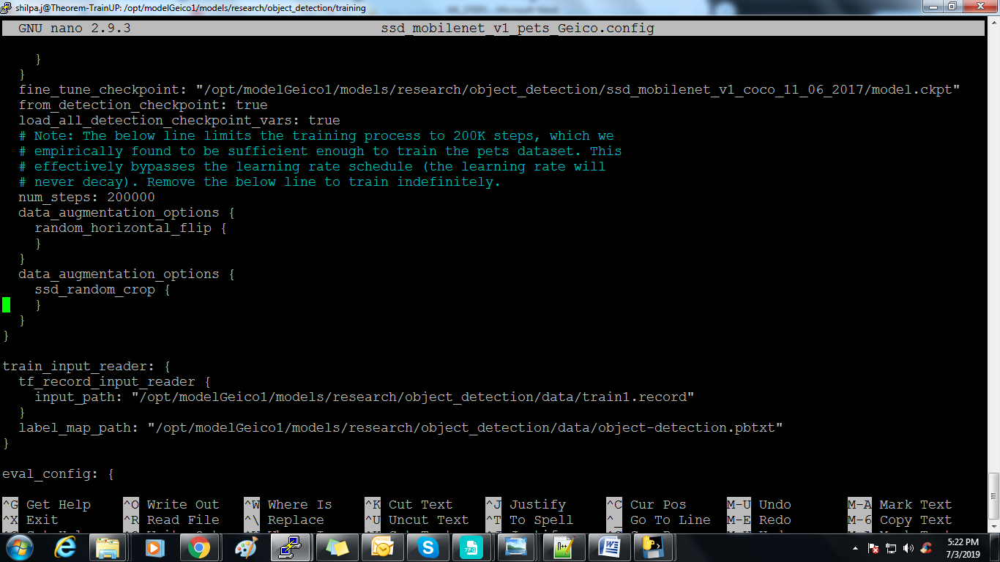

Set the path to fine_tune_checkpoint as above screenshot pointing to model.ckpt as in above screenshot.
Set the input_path under  train_input_reader : to /opt/modelGeico1/models/research/object_detection/data/train.record
Set the label_map_path  under  train_input_reader :to  /opt/modelGeico1/models/research/object_detection/data/object-detection.pbtxt

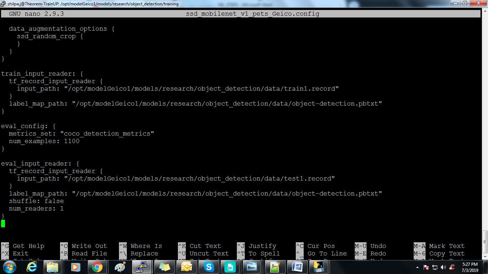

Set the input_path under eval_input_reader :  to /opt/modelGeico1/models/research/object_detection/data/test.record
Set the label_map_path under eval_input_reader: to  /opt/modelGeico1/models/research/object_detection/data/object-detection.pbtxt
	Save all changes made to config file and run the command-
Check for train.py file in “object_detection” folder, if its not found it must be inside object_detection/legacy/train.py which needs to be cut and pasted into “models/research/object_detection/ “ to run the below command.
python3 train.py --logtostderr --train_dir=training/ --pipeline_config_path=training/ssd_mobilenet_v1_pets_Geico.config
Barring errors, you should see output like:

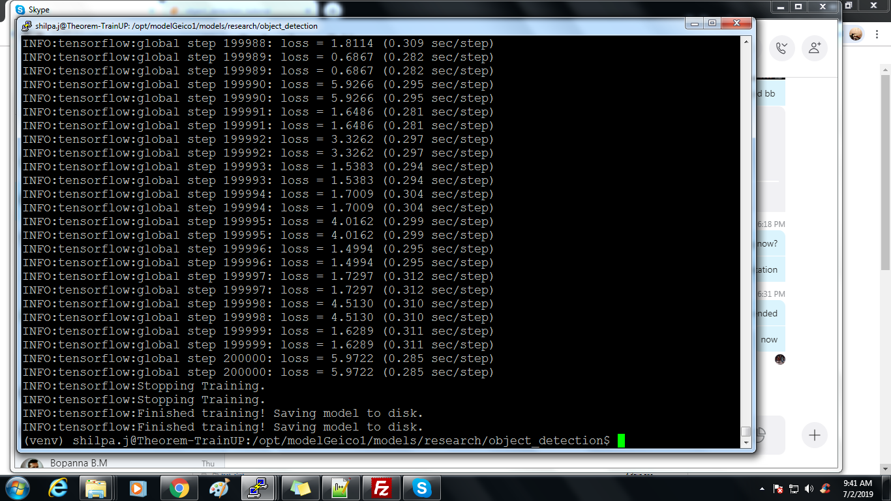

Our steps start at 1 and the loss will be much higher. Depending on our GPU and how much training data we have, this process will take varying amounts of time. On something like a 1080ti, it should take only about an hour or so. If we have a lot of training data, it might take much longer. We want to shoot for a loss of about ~1 on average (or lower). I wouldn't stop training until we are for sure under 2. We can check how the model is doing via TensorBoard. Our models/research/object_detection/training directory will have new event files that can be viewed via TensorBoard.

  From  models/research/object_detection, via terminal, you start TensorBoard with:
tensorboard --logdir='training'
After this we can view the loss and learning rate of OS pictorially through different graphs on tensorboard during the training as below screenshots.
This runs on 172.19.19.225:6006 (visit in our browser)

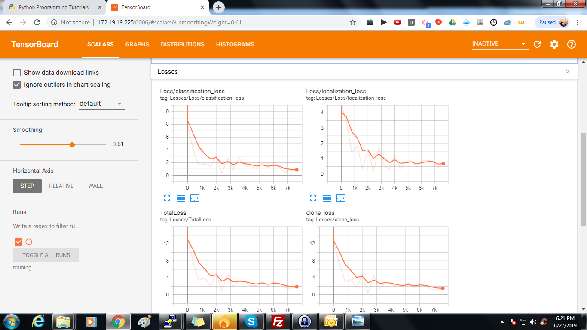

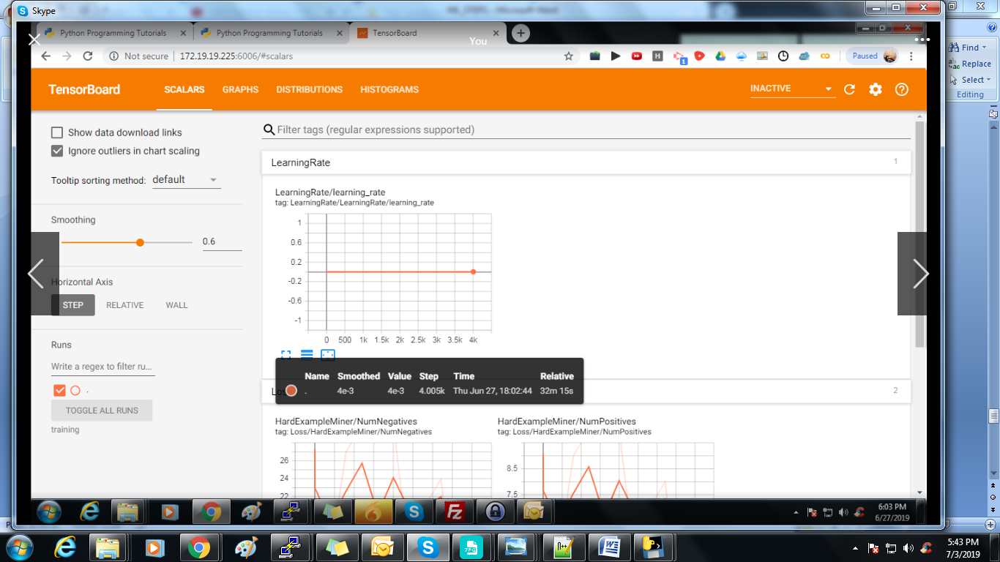

 When  the process of training has started and simultaneously  when tensorboard shows up the loss to be below 1 we can start exporting the graphs by checking out for every step of epochs wherein the tensorboard info and meta,data,index files are getting saved to training dir under models/research/object_detection path.We can stop the training once the loss has reached  <1 in tensorboard.

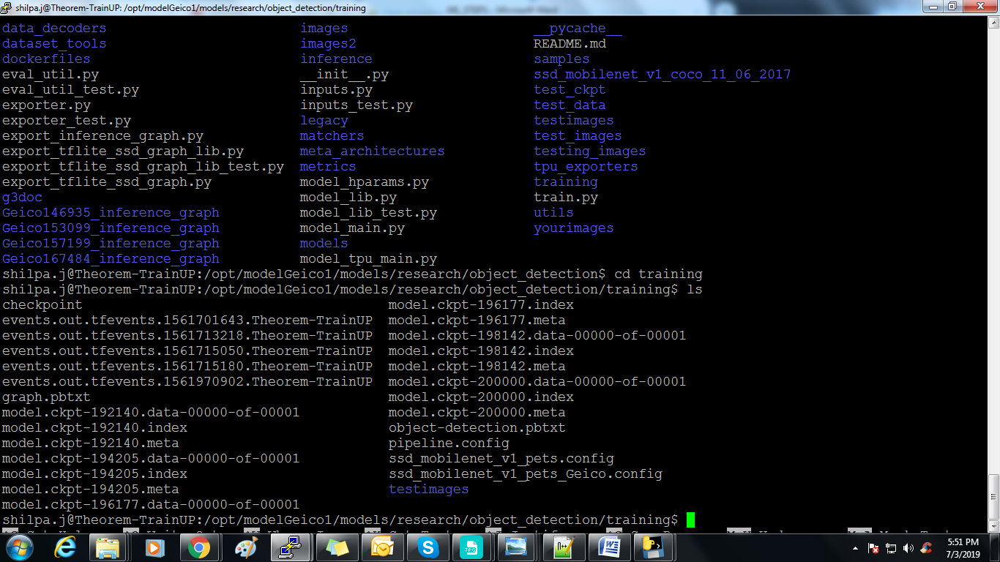

This is our training dir wherein all tensor board info ,meta,data,index files are saved as above screenshot.

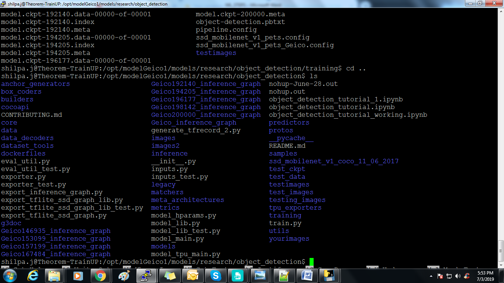

For us, in the models/object_detection directory, there is a script that does this for us: export_inference_graph.py Make sure we have all 3 files meta,data,index files for each step as training progresses in training dir
To run this, we just need to pass in our checkpoint and our pipeline config, then wherever you want the inference graph to be placed. For example:
'''
python3 export_inference_graph.py \
	--input_type image_tensor \
	--pipeline_config_path training/ssd_mobilenet_v1_pets_Geico.config \
    	--trained_checkpoint_prefix training/model.ckpt-192140 \
    	--output_directory Geico192140_inference_graph
'''
Below screenshot depicts the inference graphs exported for my ssd model during training-

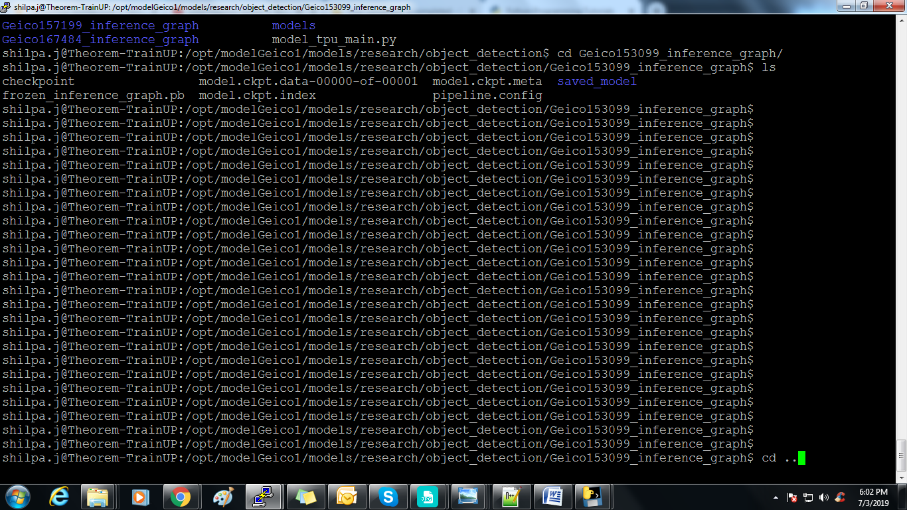

If you get an error about no module named 'nets', then you need to re run:

### From models/research/
'''
export PYTHONPATH=$PYTHONPATH:`pwd`:`pwd`/slim
'''
### switch back to object_detection after this and re run the above command

1. Export the inference graphs for respective models created due to training by monitoring different types of losses and learning rate/accuracy of our OS on tensorboard in real time.

2. Increase/Decrease the batch size to avoid memory issues depending on your system configuration to handle data.
- Step-6: Testing Custom Object Detector –
Now, we're just going to use the sample notebook, edit it, and see how our model does on some testing images. I copied some of my models/research/object_detection/testing_images into the  models/research/object_detection/test_images directory, and renamed them to be image3.jpg, image4.jpg...etc.
 Booting up jupyter notebook and opening the object_detection_tutorial.ipynb, let's make a few changes. First, head to the Variables section, and let's change the model name, and the paths to the checkpoint and the labels:
 Open jupyter notebook from the path models/research/object-detection as below screenshot.

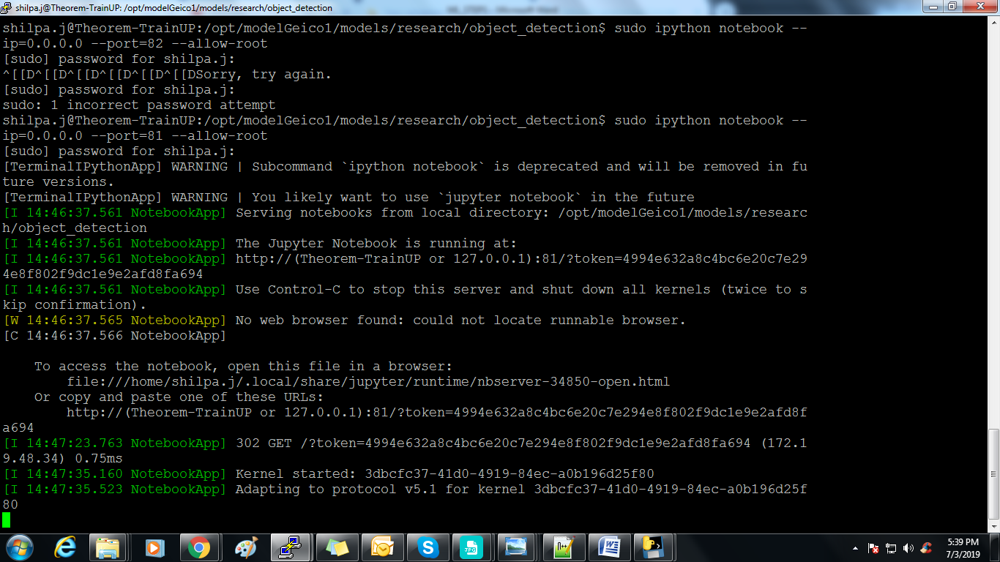

Once we launch jupyter notebook ,we need to open object_detection_tutorial.ipynb

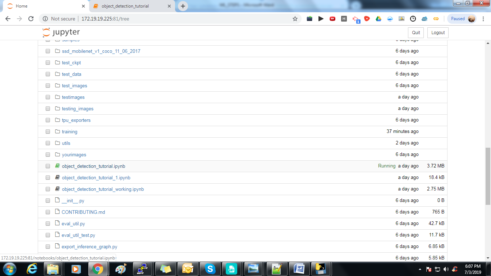

Edit  object_detection_tutorial.ipynb according to below screenshots

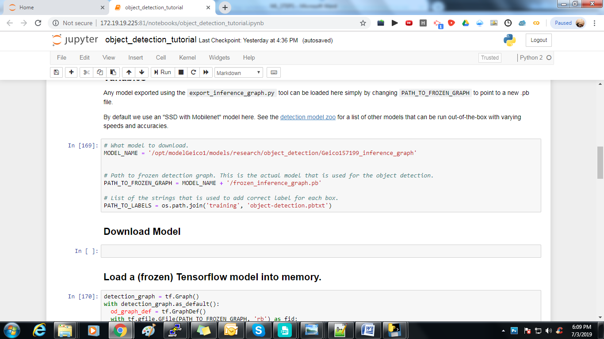

'''
Edit  MODEL_NAME = ' /opt/modelGeico1/models/research/object_detection/Geico153099_inference_graph’
'''
This is my path for the particular model,meta,data file already exported under object_detection folder.

 Change the below path as per above screenshot . “testing_images” folder contains all new images for detection.
PATH_TO_TEST_IMAGES_DIR = '/opt/modelGeico1/models/research/object_detection/testing_images'
 Below code is used to change the number of new images 
TEST_IMAGE_PATHS = [ os.path.join(PATH_TO_TEST_IMAGES_DIR, 'image{}.jpg'.format(i)) for i in range(1, 13) ]
After making all these changes, run the code over new images to visualize the detection in jupyter.
Trialing out different exported graphs/models for detection for the new image to locate and detect the object in the image accurately.
 Our results after detection-

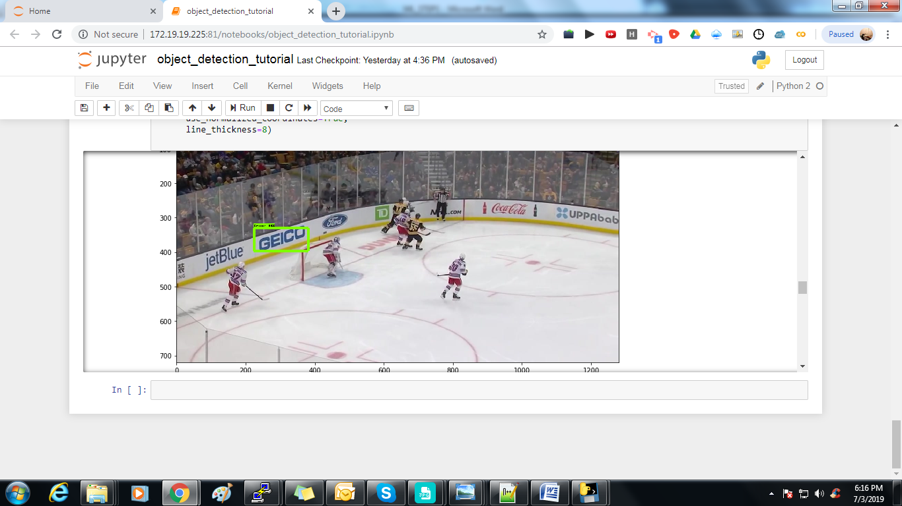

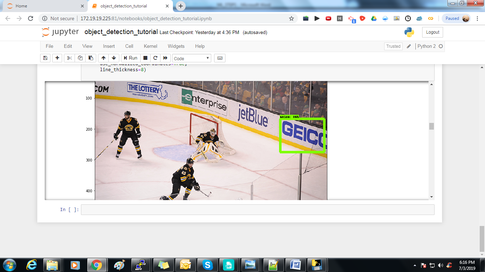

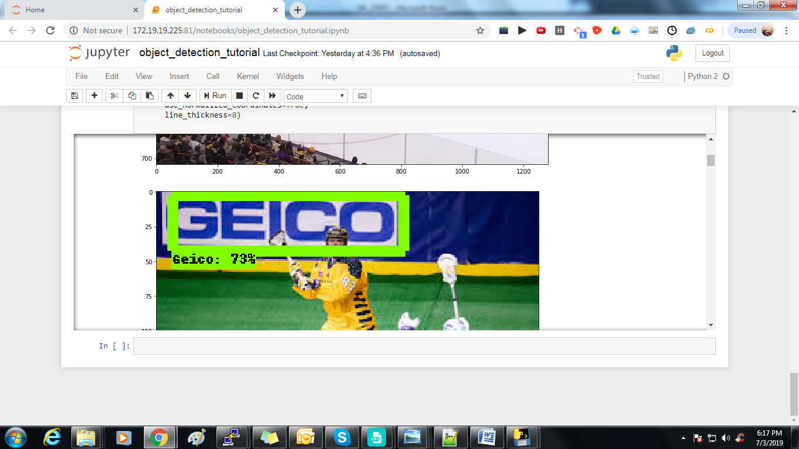

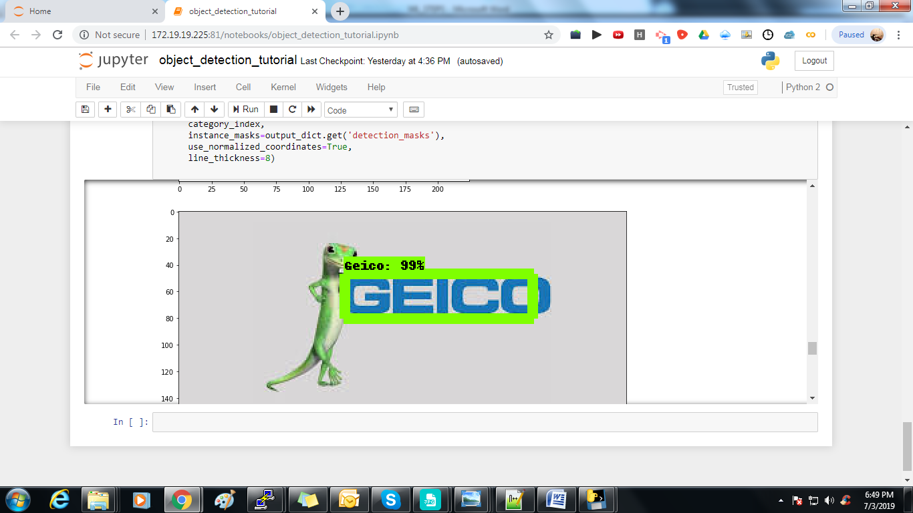

 
 

